# Data manipulation in Jamovi

## Directions:

Complete each step of the assignment below.

## Package management in R

``` r
# keep a list of the packages used in this script
packages <- c("tidyverse","rio","jmv")
```

This next code block has eval=FALSE because you don’t want to run it
when knitting the file. Installing packages when knitting an R notebook
can be problematic.

``` r
# check each of the packages in the list and install them if they're not installed already
for (i in packages){
  if(! i %in% installed.packages()){
    install.packages(i,dependencies = TRUE)
  }
  # show each package that is checked
  print(i)
}
```

``` r
# load each package into memory so it can be used in the script
for (i in packages){
  library(i,character.only=TRUE)
  # show each package that is loaded
  print(i)
}
```

    ## ── Attaching packages ─────────────────────────────────────── tidyverse 1.3.2 ──
    ## ✔ ggplot2 3.4.0      ✔ purrr   1.0.1 
    ## ✔ tibble  3.1.8      ✔ dplyr   1.0.10
    ## ✔ tidyr   1.2.1      ✔ stringr 1.5.0 
    ## ✔ readr   2.1.3      ✔ forcats 0.5.2 
    ## ── Conflicts ────────────────────────────────────────── tidyverse_conflicts() ──
    ## ✖ dplyr::filter() masks stats::filter()
    ## ✖ dplyr::lag()    masks stats::lag()

    ## [1] "tidyverse"
    ## [1] "rio"
    ## [1] "jmv"

A note about working with packages and functions in R: When installing
packages you may see notifications that SomePackage::function() masks
OtherPackage::function(). What that means is that two different packages
used the same function name. The functions may or may not do the same
thing, but for whatever reason the pogrammers of each package happened
to choose the same name for a function in their respective package. The
last package installed will be the version of that function that will be
used if only the function name is used in your R code. The
SomePackage::function() notation with the colons in it means to use the
function named function() from the package named SomePackage. I think I
have decided when I write R code that I will always try to stick to that
notation. That way it’s very clear which package a desired function
comes from and there will be no problems with masking if different
packages used the same function name.

## Open data file

The rio package works for importing several different types of data
files. We’re going to use it in this class. There are other packages
which can be used to open datasets in R. You can see several options by
clicking on the Import Dataset menu under the Environment tab in
RStudio. (For a csv file like we have this week we’d use either From
Text(base) or From Text (readr). Try it out to see the menu dialog.)

``` r
# import the Week3.rds dataset into RStudio

# Using the file.choose() command allows you to select a file to import from another folder.
#dataset <- rio::import(file.choose())

# This command will allow us to import the rds file included in our project folder.

dataset <- rio::import("week3.rds")
```

## Get R code from Jamovi output

You can get the R code for most of the analyses you do in Jamovi.

1.  Click on the three vertical dots at the top right of the Jamovi
    window.
2.  Click on the Syndax mode check box at the bottom of the Results
    section.
3.  Close the Settings window by clicking on the Hide Settings arrow at
    the top right of the settings menu.
4.  you should now see the R code for each of the analyses you just ran.

## Run Jamovi code in RStudio

1.  Copy the code for the descriptive statistics for the categorical
    variables in Jamovi and run the code block here in RStudio.

    -   Right click on the code block in Jamovi.
    -   Select Syntax - Copy
    -   Paste it in the code block below.
    -   You may need to change the name of the dataset to match the name
        of the data frame in RStudio. data = week3 (or the name of your
        data frame)

``` r
jmv::descriptives(
    data = dataset,
    vars = vars(lvst4_recode, frst1, frst2, frst3, sex, research, lvst1, lvst2, lvst3, lvst4),
    freq = TRUE,
    bar = TRUE,
    mean = FALSE,
    median = FALSE)
```

    ## Warning in FUN(X[[i]], ...): no non-missing arguments to max; returning -Inf

    ## 
    ##  DESCRIPTIVES
    ## 
    ##  Descriptives                                                                                                             
    ##  ──────────────────────────────────────────────────────────────────────────────────────────────────────────────────────── 
    ##                          lvst4_recode    frst1    frst2    frst3    sex    research    lvst1    lvst2    lvst3    lvst4   
    ##  ──────────────────────────────────────────────────────────────────────────────────────────────────────────────────────── 
    ##    N                               96       96       96       96     96          96       96       96       96       96   
    ##    Missing                          0        0        0        0      0           0        0        0        0        0   
    ##    Standard deviation       0.7879994                                                                                     
    ##    Minimum                          1                                                                                     
    ##    Maximum                          5                                                                                     
    ##  ──────────────────────────────────────────────────────────────────────────────────────────────────────────────────────── 
    ## 
    ## 
    ##  FREQUENCIES
    ## 
    ##  Frequencies of lvst4_recode                        
    ##  ────────────────────────────────────────────────── 
    ##    Levels    Counts    % of Total    Cumulative %   
    ##  ────────────────────────────────────────────────── 
    ##    1              2       2.08333         2.08333   
    ##    2             21      21.87500        23.95833   
    ##    3             49      51.04167        75.00000   
    ##    4             22      22.91667        97.91667   
    ##    5              2       2.08333       100.00000   
    ##  ────────────────────────────────────────────────── 
    ## 
    ## 
    ##  Frequencies of frst1                                   
    ##  ────────────────────────────────────────────────────── 
    ##    Levels        Counts    % of Total    Cumulative %   
    ##  ────────────────────────────────────────────────────── 
    ##    Not at all         2       2.08333         2.08333   
    ##    a little          25      26.04167        28.12500   
    ##    moderately        45      46.87500        75.00000   
    ##    mostly            21      21.87500        96.87500   
    ##    completely         3       3.12500       100.00000   
    ##  ────────────────────────────────────────────────────── 
    ## 
    ## 
    ##  Frequencies of frst2                                   
    ##  ────────────────────────────────────────────────────── 
    ##    Levels        Counts    % of Total    Cumulative %   
    ##  ────────────────────────────────────────────────────── 
    ##    Not at all        27      28.12500        28.12500   
    ##    a little          43      44.79167        72.91667   
    ##    moderately        20      20.83333        93.75000   
    ##    mostly             5       5.20833        98.95833   
    ##    completely         1       1.04167       100.00000   
    ##  ────────────────────────────────────────────────────── 
    ## 
    ## 
    ##  Frequencies of frst3                                   
    ##  ────────────────────────────────────────────────────── 
    ##    Levels        Counts    % of Total    Cumulative %   
    ##  ────────────────────────────────────────────────────── 
    ##    Not at all         6       6.25000         6.25000   
    ##    a little          21      21.87500        28.12500   
    ##    moderately        31      32.29167        60.41667   
    ##    mostly            27      28.12500        88.54167   
    ##    completely        11      11.45833       100.00000   
    ##  ────────────────────────────────────────────────────── 
    ## 
    ## 
    ##  Frequencies of sex                                 
    ##  ────────────────────────────────────────────────── 
    ##    Levels    Counts    % of Total    Cumulative %   
    ##  ────────────────────────────────────────────────── 
    ##    Male          48      50.00000        50.00000   
    ##    Female        48      50.00000       100.00000   
    ##  ────────────────────────────────────────────────── 
    ## 
    ## 
    ##  Frequencies of research                            
    ##  ────────────────────────────────────────────────── 
    ##    Levels    Counts    % of Total    Cumulative %   
    ##  ────────────────────────────────────────────────── 
    ##    Quant         46      47.91667        47.91667   
    ##    Qual          50      52.08333       100.00000   
    ##  ────────────────────────────────────────────────── 
    ## 
    ## 
    ##  Frequencies of lvst1                                   
    ##  ────────────────────────────────────────────────────── 
    ##    Levels        Counts    % of Total    Cumulative %   
    ##  ────────────────────────────────────────────────────── 
    ##    Not at all         5       5.20833         5.20833   
    ##    a little          29      30.20833        35.41667   
    ##    moderately        42      43.75000        79.16667   
    ##    mostly            15      15.62500        94.79167   
    ##    completely         5       5.20833       100.00000   
    ##  ────────────────────────────────────────────────────── 
    ## 
    ## 
    ##  Frequencies of lvst2                                   
    ##  ────────────────────────────────────────────────────── 
    ##    Levels        Counts    % of Total    Cumulative %   
    ##  ────────────────────────────────────────────────────── 
    ##    Not at all         9       9.37500         9.37500   
    ##    a little          32      33.33333        42.70833   
    ##    moderately        40      41.66667        84.37500   
    ##    mostly            14      14.58333        98.95833   
    ##    completely         1       1.04167       100.00000   
    ##  ────────────────────────────────────────────────────── 
    ## 
    ## 
    ##  Frequencies of lvst3                                   
    ##  ────────────────────────────────────────────────────── 
    ##    Levels        Counts    % of Total    Cumulative %   
    ##  ────────────────────────────────────────────────────── 
    ##    Not at all         4       4.16667         4.16667   
    ##    a little          11      11.45833        15.62500   
    ##    moderately        38      39.58333        55.20833   
    ##    mostly            29      30.20833        85.41667   
    ##    completely        14      14.58333       100.00000   
    ##  ────────────────────────────────────────────────────── 
    ## 
    ## 
    ##  Frequencies of lvst4                                   
    ##  ────────────────────────────────────────────────────── 
    ##    Levels        Counts    % of Total    Cumulative %   
    ##  ────────────────────────────────────────────────────── 
    ##    Not at all         2       2.08333         2.08333   
    ##    a little          22      22.91667        25.00000   
    ##    moderately        49      51.04167        76.04167   
    ##    mostly            21      21.87500        97.91667   
    ##    completely         2       2.08333       100.00000   
    ##  ──────────────────────────────────────────────────────

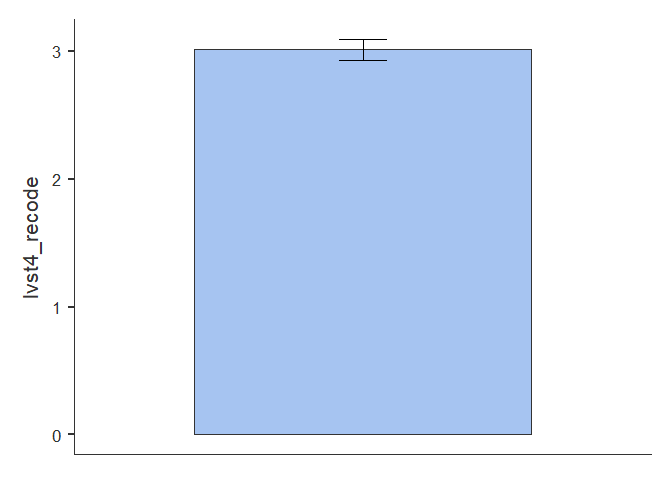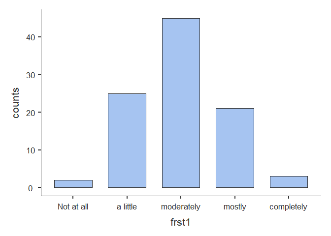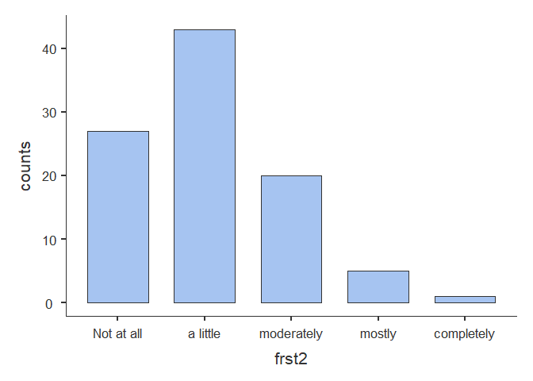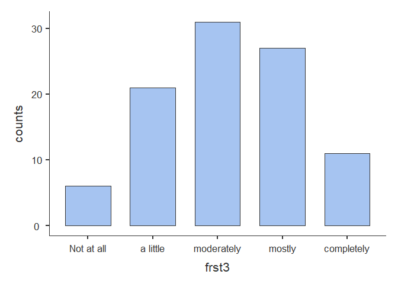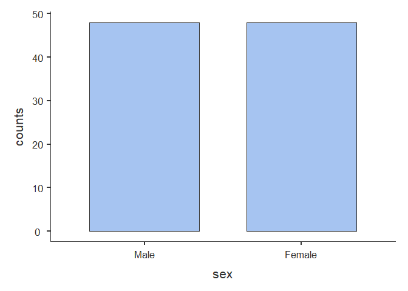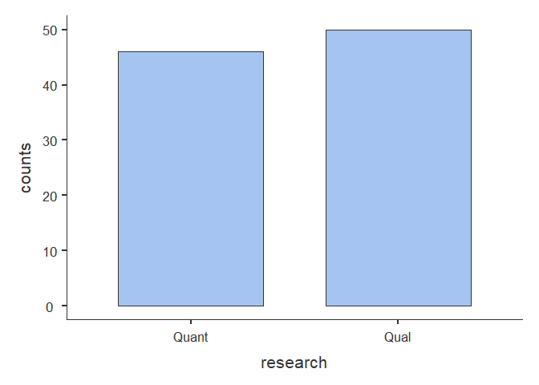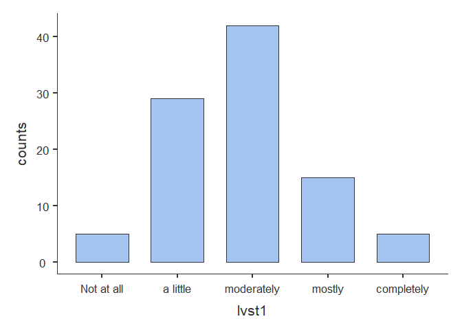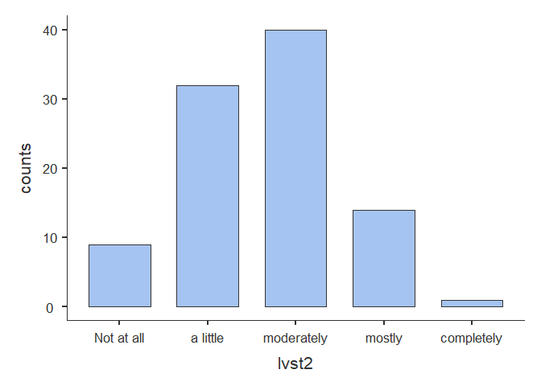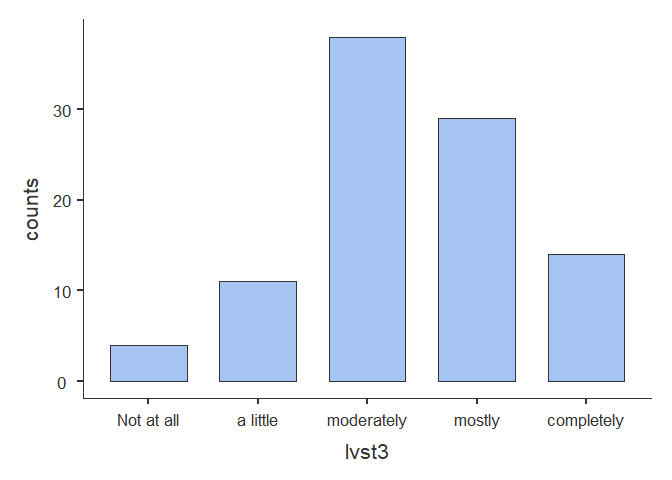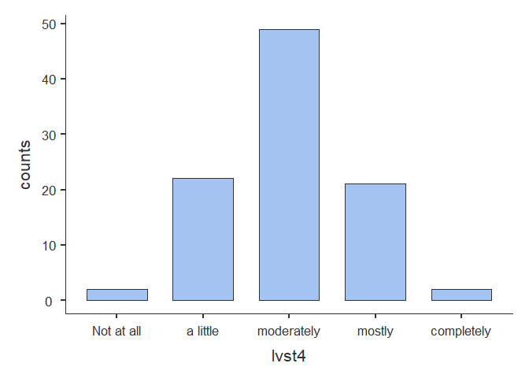

1.  Copy the code block for the descriptive statistics for the
    continuous variables and run it here in RStudio.

``` r
jmv::descriptives(
    data = dataset,
    vars = vars(height, weight, BMI, LOSS_total, LOSS_mean, LOSS_total_z, LOSS_mean_z, FOSS_total, FOSS_mean, FOSS_total_z, FOSS_mean_z),
    hist = TRUE,
    box = TRUE,
    range = TRUE)
```

    ## 
    ##  DESCRIPTIVES
    ## 
    ##  Descriptives                                                                                                                                                                       
    ##  ────────────────────────────────────────────────────────────────────────────────────────────────────────────────────────────────────────────────────────────────────────────────── 
    ##                          height      weight      BMI         LOSS_total    LOSS_mean    LOSS_total_z    LOSS_mean_z     FOSS_total    FOSS_mean    FOSS_total_z     FOSS_mean_z     
    ##  ────────────────────────────────────────────────────────────────────────────────────────────────────────────────────────────────────────────────────────────────────────────────── 
    ##    N                           96          96          96            96           96              96              96            96           96               96               96   
    ##    Missing                      0           0           0             0            0               0               0             0            0                0                0   
    ##    Mean                  160.7812    67.64375    25.94418      11.90625     2.976562    1.066132e-17    1.066132e-17      8.208333     2.736111    -2.438960e-16    -2.064932e-17   
    ##    Median                159.7500    65.50000    25.89624      12.00000     3.000000      0.03651672      0.03651672      8.000000     2.666667      -0.08675536      -0.08675536   
    ##    Standard deviation    19.29801    17.85642    4.710536      2.567317    0.6418293        1.000000        1.000000      2.401388    0.8004628         1.000000         1.000000   
    ##    Range                 81.30000    94.60000    33.09063      12.00000     3.000000        4.674140        4.674140      11.00000     3.666667         4.580683         4.580683   
    ##    Minimum               117.4000    9.200000    6.273350      6.000000     1.500000       -2.300553       -2.300553      3.000000     1.000000        -2.168884        -2.168884   
    ##    Maximum               198.7000    103.8000    39.36398      18.00000     4.500000        2.373587        2.373587      14.00000     4.666667         2.411799         2.411799   
    ##  ──────────────────────────────────────────────────────────────────────────────────────────────────────────────────────────────────────────────────────────────────────────────────

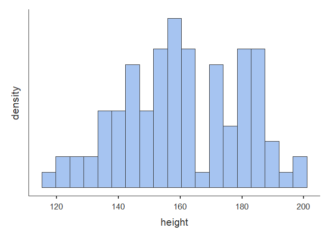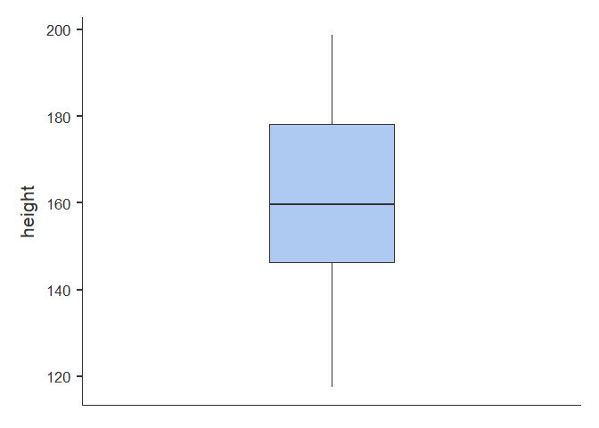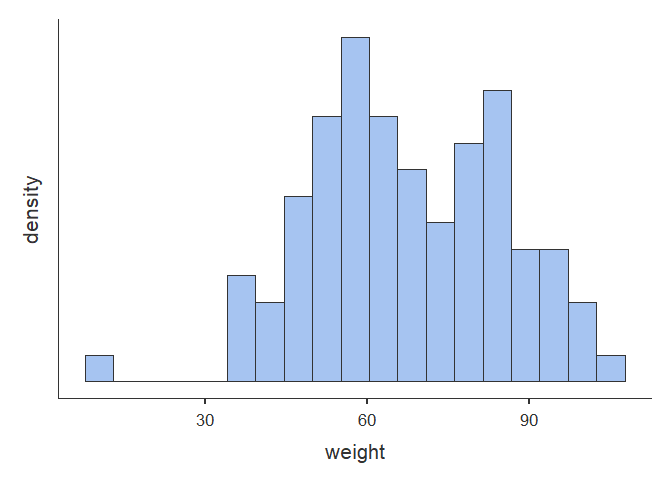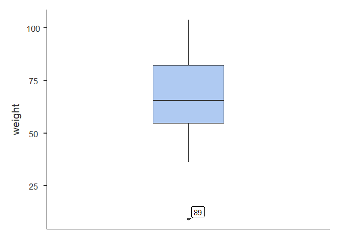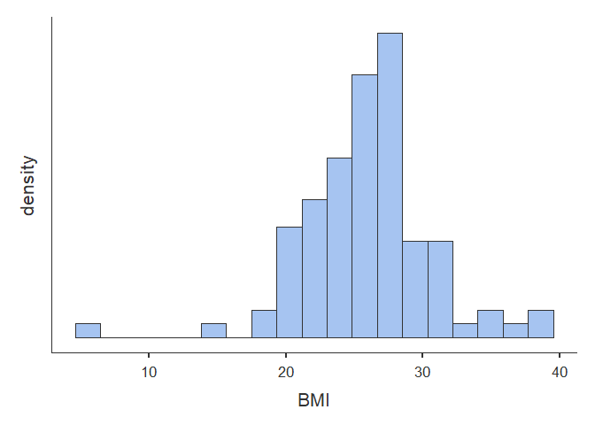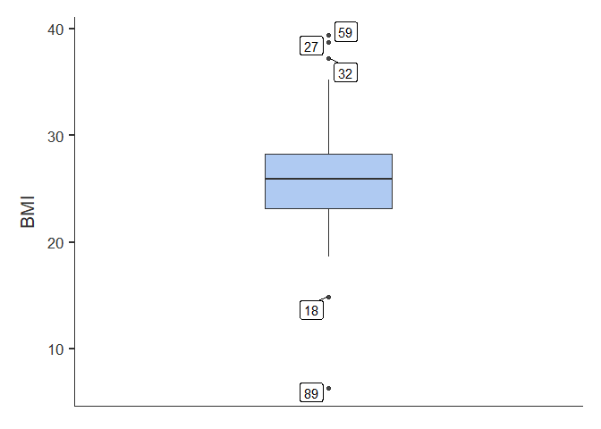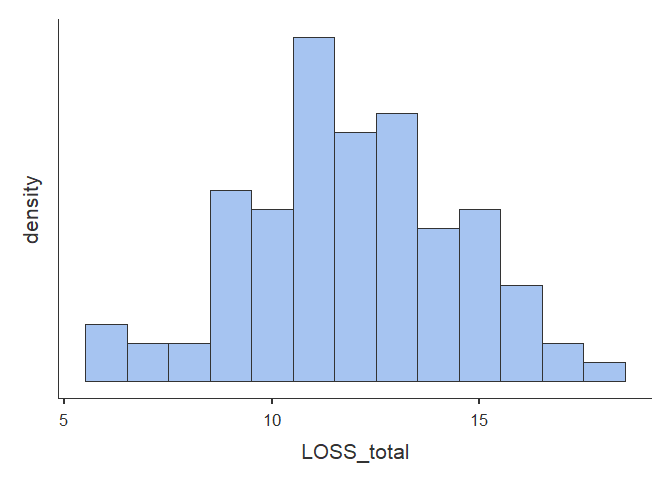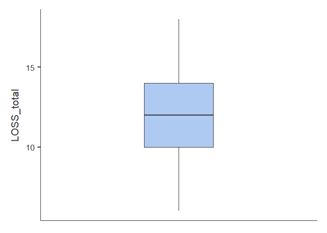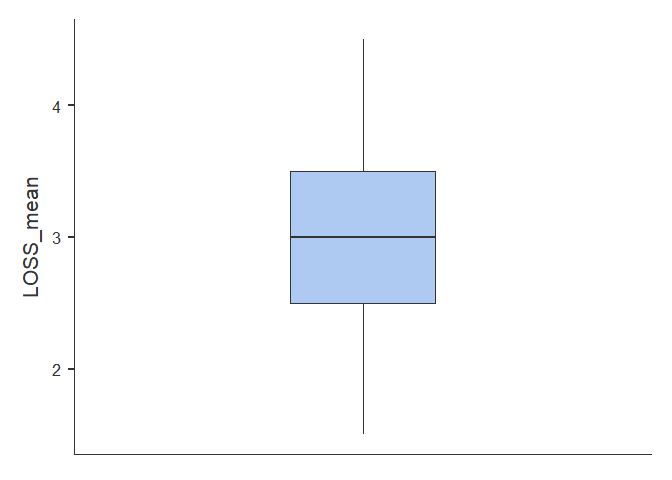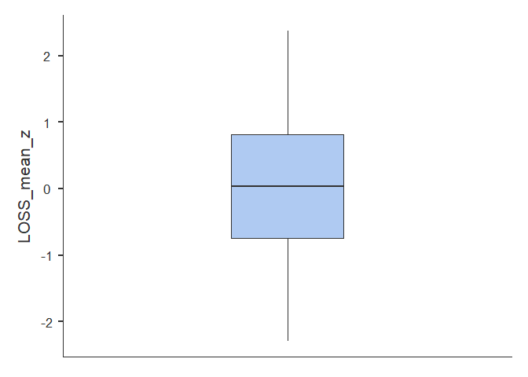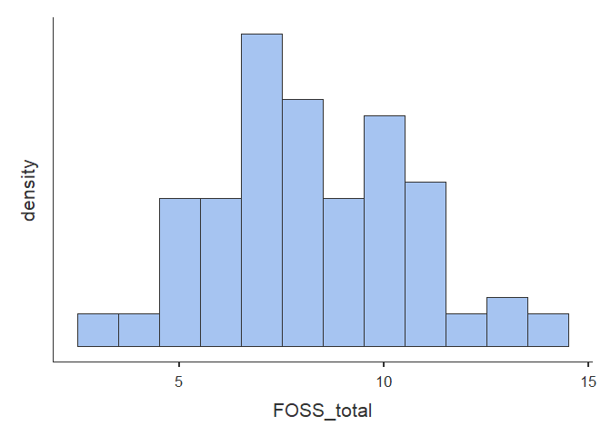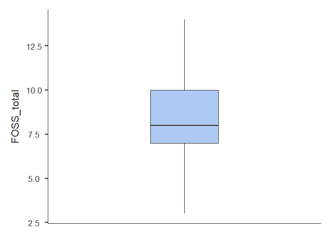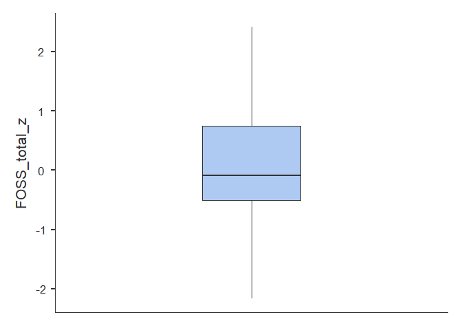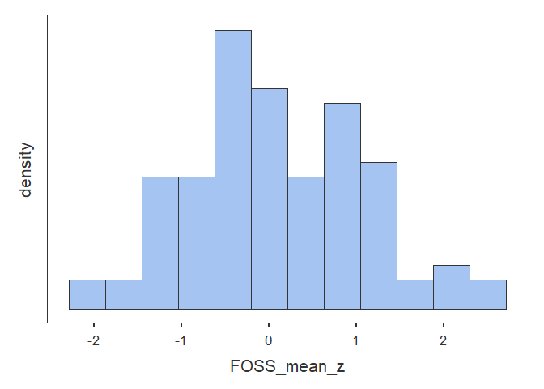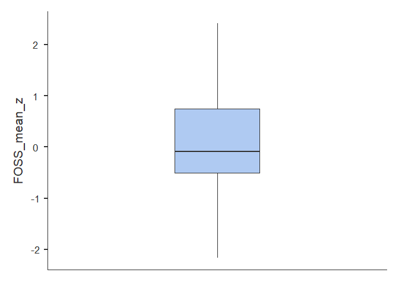

## Some notes on Jamovi

-   Some advantages of Jamovi

    -   Jamovi takes some of the difficulty out of remembering commands
        to run statistical analyses by providing point and click menus.
    -   Jamovi is freely available to anyone (and pretty easy to
        install) so it’s easy to share output. (You can also export to
        other formats.)
    -   The jmv package collects basic statistical anayses into a single
        package so it makes learning statistics in R a bit easier.
    -   The Jamovi output is formatted very nicely. The tables are
        pretty much APA compliant.

-   Some limitations of Jamovi

    -   Jamovi does not allow you to make notes or write in the output
        like you can in RStudio. Interpreting output is as important as
        getting output in the first place. Making some notes to go along
        with what you analyze is pretty useful and important.
    -   Jamovi does not currently have the wide variety of packages
        available which can be run in RStudio. It’s a good idea to know
        both.
    -   Jamovi is still undergoing significant development. There are
        some parts which may still be buggy. (Like importing the data
        set and having the empty columns at the beginning.)

## Save your output.

Save this assignment as a markdown file.

## Submit your assignment.

Submit the output you just saved for your assignment.
